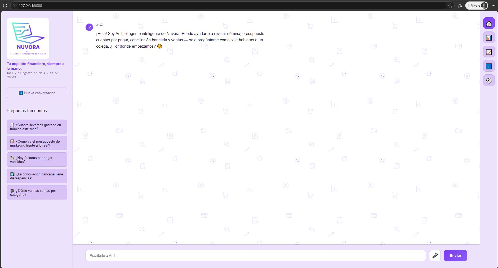
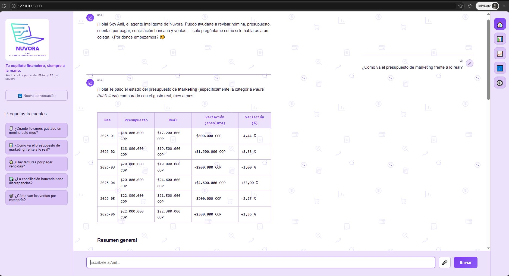
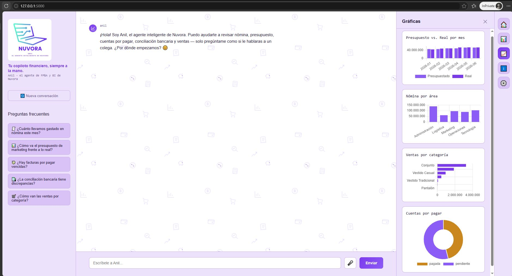
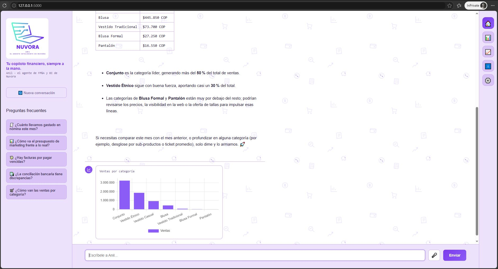

# 🧠 Anil — Agente de IA para FP&A y BI de Nuvora

**Anil** es un agente financiero inteligente construido como proyecto de portafolio. Responde preguntas sobre nómina, presupuesto, cuentas por pagar, conciliación bancaria y ventas de **Nuvora**, una tienda en línea ficticia — usando siempre datos reales de una base de datos, nunca cifras inventadas.

> Antes de armar el reporte, antes de la reunión, antes de la duda que te quita el sueño: Anil te da la cifra exacta en segundos.

## ✨ Características

- 💬 **Chat conversacional** — pregúntale a Anil como le preguntarías a un colega de finanzas, sin fórmulas ni filtros complicados.
- 🧠 **Agente con herramientas (tool-calling)** — Anil consulta la base de datos en tiempo real antes de responder, usando el modelo `openai/gpt-oss-120b` vía Groq API.
- 📊 **Dashboard interactivo** — gráficas de presupuesto vs. real, nómina por área, ventas por categoría y cuentas por pagar (Chart.js), con click para ampliar.
- 📈 **Gráficas generadas en el chat** — si le pides una gráfica en lenguaje natural, Anil la genera y la muestra directamente en la conversación.
- 📅 **Comparación entre periodos** — Anil puede comparar cifras de un mes contra otro automáticamente.
- 🎙️ Soporte para comando de voz (Web Speech API).
- 🎨 Interfaz con panel deslizante (drawer) para Resumen, Gráficas, Acerca de y Configuración.

## 🛠️ Stack tecnológico

| Capa | Tecnología |
|---|---|
| Backend | Python, Flask |
| Agente / LLM | Groq API (`openai/gpt-oss-120b`) |
| Base de datos | SQLite |
| Frontend | HTML, CSS, JavaScript |
| Gráficas | Chart.js 4 |

## 📁 Estructura del proyecto

```
anil-ai/
├── data/
│   ├── build_db.py       # Genera la base de datos
│   └── seed_data.sql     # Datos de ejemplo de Nuvora
├── src/
│   ├── agent.py          # Lógica del agente y loop de tool-calling
│   ├── database.py       # Consultas a la base de datos
│   ├── tools.py          # Definición de herramientas del agente
│   ├── web_app.py        # Rutas Flask / API
│   ├── static/            # CSS y JavaScript
│   └── templates/         # HTML
├── tests/
│   └── test_database.py
├── requirements.txt
└── .gitignore
```

## 🚀 Cómo correrlo localmente

1. Clona el repositorio:
   ```
   git clone https://github.com/NatAIAnalytics/anil-ai.git
   cd anil-ai
   ```

2. Crea y activa un entorno virtual:
   ```
   python -m venv venv
   venv\Scripts\activate   # Windows
   ```

3. Instala las dependencias:
   ```
   pip install -r requirements.txt
   ```

4. Crea un archivo `.env` en la raíz del proyecto con tu API key de Groq:
   ```
   GROQ_API_KEY=tu_api_key_aqui
   ```

5. Genera la base de datos:
   ```
   python data/build_db.py
   ```

6. Corre la aplicación:
   ```
   python src/web_app.py
   ```

7. Abre tu navegador en `http://localhost:5000`

## 📸 Capturas de pantalla

### Vista inicial del chat


### Conversación con datos reales
Anil responde con tablas y resúmenes generados a partir de la base de datos de Nuvora.


### Dashboard de gráficas
Presupuesto vs. real, nómina por área, ventas por categoría y cuentas por pagar.


### Gráfica generada dentro del chat
Anil puede generar gráficas directamente en la conversación cuando se le pide en lenguaje natural.


## 👩‍💻 Autora

**Natalia Lara** — proyecto de portafolio en FP&A y Business Intelligence.
